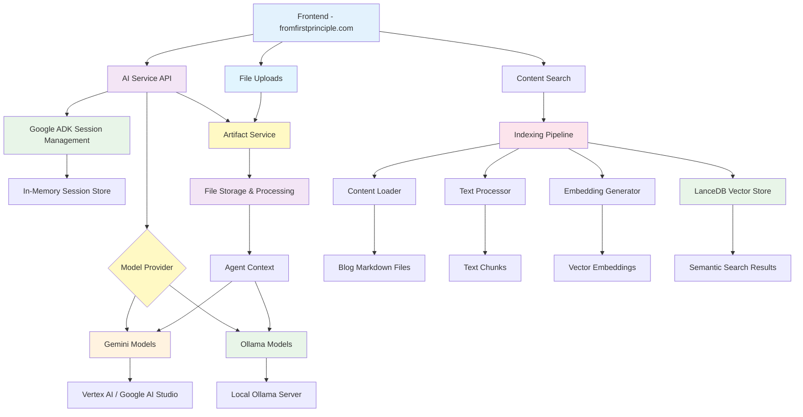

# From First Principles - AI Service


AI backend service for the From First Principles platform, providing intelligent chat capabilities and semantic content indexing powered by Google's Gemini models, local Ollama models, and modern vector search technology.

## Overview

This service provides a comprehensive AI platform with two main components:

### Agent Service

A FastAPI-based backend that hosts an agent with the following functionalities:

- **Multi-Model Support**: Choose between Google Gemini models or local Ollama models
- **Session Management**: Persistent conversation history across multiple interactions
- **File Upload & Artifact Service**: Support for file attachments with automatic processing and integration
- **CORS Configuration**: Secure cross-origin requests from the frontend
- **Static File Serving**: Integrated frontend serving capabilities
- **Production Ready**: Deployment scripts and production configurations

### 📚 Content Indexing System

A modern semantic search pipeline that transforms your blog content into an intelligent, searchable knowledge base:

- **🧠 Dual Search Modes**: Semantic search using AI embeddings for conceptual matching, plus traditional keyword search for exact terms
- **⚡ High Performance**: Vector similarity using LanceDB with GPU acceleration and intelligent caching
- **🎨 Modern CLI**: Beautiful `index-cli` interface with rich terminal output, progress tracking, and comprehensive help
- **🔧 Developer Friendly**: Complete Python API, detailed statistics, error handling, and extensive documentation
- **📊 Smart Processing**: Automatic text chunking, metadata extraction, and embedding generation with 384-dimensional vectors

**How it Works**: The system processes your markdown blog posts, splits them into semantic chunks, generates AI embeddings using sentence transformers, and stores everything in a high-performance vector database. This enables both conceptual similarity search ("find posts about machine learning") and exact keyword matching ("find posts mentioning 'LanceDB'").

**Perfect For**: Content discovery, research assistance, finding related articles, and building intelligent search experiences for your blog readers.

👀 **For complete technical details, architecture diagrams, and API documentation**, see the [**Indexing System Documentation**](src/indexing/README.md).

## Architecture



## Development Setup

### Prerequisites

- Python 3.11+
- uv package manager
- Google Cloud CLI (for Vertex AI)
- ngrok (for production deployment)

### Project Structure

```
services/ai/
├── src/
│   ├── app/                 # FastAPI chat service
│   │   ├── api/            # API endpoints
│   │   ├── core/           # Core functionality
│   │   ├── artifacts/      # File validation & processing
│   │   ├── models.py       # Data models
│   │   ├── schemas.py      # API schemas
│   │   └── main.py         # FastAPI application
│   ├── agents/             # AI model agents
│   └── indexing/           # Content indexing pipeline
│       ├── main.py         # CLI entry point
│       ├── builder.py      # Main pipeline orchestrator
│       ├── loader.py       # Markdown content loader
│       ├── embedder.py     # Vector embedding generator
│       ├── database.py     # LanceDB vector store
│       └── README.md       # Detailed indexing docs
├── data/
│   ├── content/            # Blog markdown files
│   └── lancedb/           # Vector database
├── scripts/               # Deployment scripts
└── CLI_USAGE.md          # CLI documentation
```

### Installation

1. **Clone and setup environment**:

```bash
git clone <repository-url>
cd services/ai

# Create virtual environment and install dependencies
uv venv
uv sync

# Install the package in editable mode (enables index-cli command)
uv pip install -e .
```

2. **Verify installation**:

```bash
# Test that the CLI is properly installed
index-cli --help

# Test the indexing pipeline
index-cli test
```

This installs all dependencies including:

- **Chat Service**: FastAPI, Google ADK, session management
- **Indexing Pipeline**: sentence-transformers, LanceDB, typer, rich
- **CLI Tools**: Modern `index-cli` command with beautiful output

2. **Configure environment**:

```bash
cp .env.example .env
# Edit .env with your configuration (see Configuration section)
```

3. **Set up Google Cloud authentication**:

```bash
gcloud auth application-default login
```

### Configuration

Update your `.env` file with the following settings:

#### Required Settings

```bash
# Server Configuration
HOST=0.0.0.0
PORT=8081
ENVIRONMENT=development

# Google Cloud Settings (for Gemini models)
GOOGLE_CLOUD_PROJECT=your-gcp-project-id
GOOGLE_CLOUD_LOCATION=us-central1
GOOGLE_API_KEY=your-google-api-key

# Model Configuration
MODEL_PROVIDER=gemini  # or 'ollama' for local models

# Ollama Settings (when MODEL_PROVIDER=ollama)
OLLAMA_API_BASE=http://localhost:11434
OLLAMA_MODEL=mistral-small3.1
OLLAMA_MODEL_PRO=llama3.2

# Authentication
AUTH_SECRET=your-super-secret-key

# Frontend URL for CORS
FRONTEND_URL=http://localhost:3000
```

#### CORS Configuration

For production deployments, update `FRONTEND_URL` to include your production domain:

```bash
FRONTEND_URL=https://fromfirstprinciple.com,http://localhost:3000
```

For ngrok integration (see Ngrok Setup section):

```bash
FRONTEND_URL=https://your-ngrok-url.ngrok-free.app,https://fromfirstprinciple.com,http://localhost:3000
```

## Ollama Model Integration

The AI service supports both Gemini and Ollama models through a configurable provider system. You can switch between providers using environment variables for local, private AI processing.

### Ollama Prerequisites

1. **Install Ollama**: Download and install Ollama from [https://ollama.ai](https://ollama.ai)

2. **Start Ollama Server**:

   ```bash
   ollama serve
   ```

3. **Download Models**: Download the models you want to use:

   ```bash
   # Download recommended models with tool support
   ollama pull mistral-small3.1
   ollama pull llama3.2

   # Verify tool support
   ollama show mistral-small3.1
   ```

### Ollama Configuration

Add these settings to your `.env` file:

```bash
# Model provider: 'gemini' or 'ollama'
MODEL_PROVIDER=ollama

# Ollama configuration (used when MODEL_PROVIDER=ollama)
OLLAMA_API_BASE=http://localhost:11434
OLLAMA_MODEL=mistral-small3.1
OLLAMA_MODEL_PRO=llama3.2
```

### Available Models

#### Gemini Models (provider: gemini)

- `gemini-2.5-flash`: Fast model for quick responses
- `gemini-2.5-pro`: Advanced model for complex reasoning

#### Ollama Models (provider: ollama)

- `mistral-small3.1`: Mistral Small with tool support
- `llama3.2`: Meta Llama 3.2 with tool support

### Model Selection

The system automatically selects models based on the provider:

- **Default Model**: Used for standard operations

  - Gemini: `gemini-2.5-flash`
  - Ollama: `mistral-small3.1`

- **Pro Model**: Used for complex reasoning (agents use this)
  - Gemini: `gemini-2.5-pro`
  - Ollama: `llama3.2`

### Switching Between Providers

To use Gemini models:

```bash
MODEL_PROVIDER=gemini
```

To use Ollama models:

```bash
MODEL_PROVIDER=ollama
```

After changing the provider, restart the service:

```bash
./scripts/deploy-server.sh restart
```

### Testing Ollama Integration

Run the integration test to verify everything works:

```bash
python test_ollama_integration.py
```

### Ollama Troubleshooting

#### Common Issues

1. **"Failed to create Ollama model"**

   - Ensure Ollama is running: `ollama serve`
   - Check the model is available: `ollama list`
   - Verify API base URL: `curl http://localhost:11434/api/tags`

2. **Tool calling issues**
   - Verify the model supports tools: `ollama show <model-name>`
   - Use models specifically designed for tool use

#### Model Recommendations

For reliable tool support with Ollama:

- **Mistral Small 3.1**: Excellent tool support, good performance
- **Llama 3.2**: Good balance of capabilities and tool support

#### Performance Notes

- Ollama models run locally, providing privacy but requiring local resources
- First requests might be slower as models load into memory
- Consider model size vs. available RAM when choosing models

### Running the Service

#### Development Mode

```bash
./scripts/deploy-server.sh start --dev
```

#### Production Mode

```bash
./scripts/deploy-server.sh start --port 8080
```

The service will be available at:

- **API Documentation**: `http://localhost:8080/docs`
- **Health Check**: `http://localhost:8080/api/v1/health`
- **Chat Endpoint**: `http://localhost:8080/api/v1/root_agent/`

## Ngrok Integration

For exposing your local AI service to the internet (useful for production frontend testing):

### Setup Steps

1. **Start the AI service**:

```bash
./scripts/deploy-server.sh start --port 8080
```

2. **Start ngrok tunnel**:

```bash
ngrok http 8080
```

3. **Update CORS configuration**:

```bash
# In .env file
FRONTEND_URL=https://abc123.ngrok-free.app,https://fromfirstprinciple.com,http://localhost:3000
```

4. **Restart the service**:

```bash
./scripts/deploy-server.sh restart --port 8080
```

5. **Update frontend configuration**:

```bash
# In frontend .env.local
NEXT_PUBLIC_API_BASE_URL=https://abc123.ngrok-free.app
```

### Testing Ngrok Setup

```bash
./tests/test_ngrok_setup.sh
```

### Frontend Integration Script

Use the utility script to easily switch between local and ngrok configurations:

```bash
cd ../frontend
./scripts/switch-api-config.sh ngrok   # Switch to ngrok
./scripts/switch-api-config.sh local   # Switch to local
```

## File Upload & Artifact Service

The AI service includes a comprehensive file upload and artifact management system that allows users to attach files to their conversations. These files are automatically processed, stored as artifacts, and made available to the AI agent for analysis and interaction.

### Features

- **Multi-File Upload**: Support for uploading multiple files simultaneously
- **Automatic File Processing**: Files are automatically validated, processed, and stored as artifacts
- **MIME Type Detection**: Intelligent detection of file types based on content and filename
- **Session Integration**: Files are associated with user sessions for context preservation
- **Agent Access**: Uploaded files are immediately available to AI agents for processing
- **Unique Naming**: Automatic filename generation to prevent conflicts
- **File Validation**: Built-in validation to ensure file safety and compatibility

### Supported File Types

The artifact service supports a wide range of file types:

#### Text Files

- **Markdown**: `.md`, `.markdown`
- **Plain Text**: `.txt`
- **Code Files**: `.py`, `.js`, `.ts`, `.jsx`, `.tsx`, `.html`, `.css`, `.json`, `.yaml`, `.yml`

#### Document Files

- **PDF**: `.pdf`
- **Microsoft Office**: `.docx`, `.xlsx`, `.pptx`
- **OpenDocument**: `.odt`, `.ods`, `.odp`
- **RTF**: `.rtf`

#### Image Files

- **Common Formats**: `.jpg`, `.jpeg`, `.png`, `.gif`, `.bmp`, `.webp`
- **Vector Graphics**: `.svg`
- **RAW Formats**: `.tiff`, `.tif`

#### Data Files

- **Spreadsheets**: `.csv`, `.tsv`
- **Structured Data**: `.json`, `.xml`
- **Configuration**: `.ini`, `.conf`, `.config`

### API Usage

#### File Upload Endpoint

The main chat endpoint supports file uploads via multipart/form-data:

```http
POST /api/v1/root_agent/
Content-Type: multipart/form-data

Form Fields:
- text: "Your message text" (optional if files provided)
- model: "gemini-2.5-flash" (optional)
- files: [file1, file2, ...] (one or more files)
```

#### Request Examples

**Text with Files**:

```bash
curl -X POST "http://localhost:8080/api/v1/root_agent/" \
  -H "X-Session-ID: your-session-id" \
  -F "text=Please analyze these documents" \
  -F "files=@document1.pdf" \
  -F "files=@data.csv" \
  -F "model=gemini-2.5-pro"
```

**Files Only**:

```bash
curl -X POST "http://localhost:8080/api/v1/root_agent/" \
  -H "X-Session-ID: your-session-id" \
  -F "files=@image.png" \
  -F "files=@report.docx"
```

#### Response Format

```json
{
  "response": "I've analyzed your uploaded files. The PDF document contains...",
  "references": {},
  "session_id": "uuid-session-id",
  "model": "gemini-2.5-pro",
  "confidence": null
}
```

### Frontend Integration

The frontend automatically handles file uploads through the chat interface:

#### File Selection

- Users can click the "+" button to select files
- Multiple files can be selected simultaneously
- Files are displayed as chips with name and size
- Individual files can be removed before sending

#### File Display

```typescript
// Files are shown as removable chips
<FileChip
  fileName={file.name}
  fileSize={file.size}
  fileType={file.type}
  onRemove={() => handleRemoveFile(id)}
/>
```

#### API Integration

```typescript
// Frontend sends files with text
const response = await sendMessage(userMessage, files, {
  signal: abortController.signal,
  model: selectedModel,
});
```

### Artifact Storage Architecture

#### Storage Flow

1. **Upload**: Files uploaded via multipart/form-data
2. **Validation**: MIME type detection and file validation
3. **Processing**: Unique filename generation with timestamp and UUID
4. **Storage**: Files stored as ADK artifacts in session context
5. **Integration**: Artifacts immediately available to AI agents

#### Filename Generation

```python
# Generated filename format
timestamp = int(time.time())
unique_id = str(uuid.uuid4())[:8]
artifact_filename = f'{timestamp}_{unique_id}_{original_filename}'
```

#### Session Association

```python
# Files are stored per session and user
await artifact_service.save_artifact(
    app_name=config.app_name,
    user_id=config.user_id,
    session_id=session_id,
    filename=artifact_filename,
    artifact=artifact_part,
)
```

### Agent Integration

Uploaded files are automatically available to AI agents through the ADK artifact system:

#### Agent Access Pattern

```python
# Agents can access uploaded files through the session context
# Files are provided as ADK Part objects with proper MIME types
# The agent can process text, images, documents, and data files
```

#### Processing Capabilities

- **Text Analysis**: Read and analyze document contents
- **Image Recognition**: Process and describe images
- **Data Processing**: Analyze CSV, JSON, and structured data
- **Code Review**: Examine and provide feedback on code files
- **Document Summarization**: Extract key information from PDFs and documents

### Configuration

#### File Validation Settings

```python
# File validator configuration
class FileValidator:
    def __init__(self):
        self.max_file_size = 10 * 1024 * 1024  # 10MB default
        self.allowed_mime_types = {
            'text/plain', 'text/markdown', 'application/pdf',
            'image/jpeg', 'image/png', 'text/csv', ...
        }
```

#### Environment Variables

```bash
# Optional file upload configuration
MAX_FILE_SIZE=10485760  # 10MB in bytes
ALLOWED_FILE_TYPES=pdf,txt,md,csv,json,png,jpg  # Comma-separated
```

### Error Handling

#### Common Error Responses

**No Content Provided**:

```json
{
  "detail": "Must provide either text message or file attachments",
  "status_code": 400
}
```

**File Validation Failed**:

```json
{
  "detail": "Uploaded file 'document.exe' has invalid type",
  "status_code": 400
}
```

**File Too Large**:

```json
{
  "detail": "File size exceeds maximum limit of 10MB",
  "status_code": 413
}
```

### Security Considerations

#### File Validation

- MIME type validation based on file content, not just extension
- File size limits to prevent abuse
- Filename sanitization to prevent path traversal
- Session-based access control

#### Storage Security

- Files are stored per session and user
- Unique filename generation prevents conflicts
- Files are not directly accessible via HTTP
- Automatic cleanup of expired sessions

### Performance Optimization

#### Efficient Processing

- Streaming file uploads for large files
- Asynchronous file processing
- MIME type detection using python-magic
- Batch processing for multiple files

#### Memory Management

- Files processed in chunks to minimize memory usage
- Automatic garbage collection of processed files
- Session-based artifact cleanup

### Development Examples

#### Testing File Uploads

**Python Test**:

```python
import requests

# Upload files with message
files = {
    'files': ('test.txt', open('test.txt', 'rb'), 'text/plain'),
    'files': ('data.csv', open('data.csv', 'rb'), 'text/csv')
}
data = {
    'text': 'Please analyze these files',
    'model': 'gemini-2.5-pro'
}

response = requests.post(
    'http://localhost:8080/api/v1/root_agent/',
    files=files,
    data=data,
    headers={'X-Session-ID': 'test-session'}
)
```

**JavaScript Test**:

```javascript
const formData = new FormData();
formData.append("text", "Analyze this document");
formData.append("files", fileInput.files[0]);
formData.append("model", "gemini-2.5-flash");

const response = await fetch("/api/v1/root_agent/", {
  method: "POST",
  headers: {
    "X-Session-ID": sessionId,
  },
  body: formData,
});
```

### Monitoring and Debugging

#### Logging

File upload operations are logged with detailed information:

```
2025-01-17 10:30:45 | INFO | Received file upload: document.pdf (1.2MB)
2025-01-17 10:30:45 | INFO | File validated successfully: application/pdf
2025-01-17 10:30:45 | INFO | Artifact saved: 1737123045_abc12345_document.pdf
2025-01-17 10:30:45 | INFO | File available to agent for session: uuid-session-id
```

#### Health Checks

```bash
# Test file upload functionality
curl -X POST "http://localhost:8080/api/v1/root_agent/" \
  -F "text=test" \
  -F "files=@small-test-file.txt"
```

### Troubleshooting

#### Common Issues

**"Must provide either text message or file attachments"**:

- Ensure at least one of `text` or `files` is provided
- Check that form fields are properly named

**"File type not supported"**:

- Verify file type is in the supported list
- Check MIME type detection is working correctly

**"File too large"**:

- Reduce file size or increase `MAX_FILE_SIZE` limit
- Consider splitting large files into smaller chunks

**Files not accessible to agent**:

- Verify session ID consistency between requests
- Check artifact service initialization
- Ensure proper session middleware configuration

### Chat Endpoint

The main endpoint supports both text messages and file uploads via multipart/form-data:

```http
POST /api/v1/root_agent/
Content-Type: multipart/form-data

Form Fields:
- text: "Your message here" (optional if files provided)
- model: "gemini-2.5-flash" (optional)
- files: [file1, file2, ...] (optional)
```

**Legacy JSON Support** (for backwards compatibility):

```http
POST /api/v1/root_agent/
Content-Type: application/json

{
  "text": "Your message here",
  "model": "gemini-2.5-flash"  // optional
}
```

**Response Format**:

```json
{
  "response": "AI response",
  "references": {},
  "session_id": "uuid",
  "model": "gemini-2.5-flash",
  "confidence": null
}
```

### Available Models

```http
GET /api/v1/root_agent/models
```

### Programmatic Model Usage

```python
from agents.model_factory import create_model, get_default_model, get_pro_model

# Create specific models
gemini_model = create_model('gemini-2.5-flash')
ollama_model = create_model('mistral-small3.1')

# Get models based on current provider
default_model = get_default_model()
pro_model = get_pro_model()
```

### Health Check

```http
GET /api/v1/health
```

## Session Management

The service uses Google ADK for session management, providing:

- **Persistent conversations**: Chat history maintained across requests
- **Session isolation**: Each session has its own conversation context
- **Automatic session creation**: New sessions created as needed
- **Memory management**: Efficient in-memory session storage

## Security

- **CORS Protection**: Configured to only allow requests from specified origins
- **Session validation**: Secure session ID generation and validation
- **Environment isolation**: Sensitive configuration in environment variables
- **Input validation**: Request validation using Pydantic models

## Deployment

### Production Deployment

```bash
./scripts/deploy-server.sh start
```

### Service Management

```bash
# Check status
./scripts/deploy-server.sh status

# Stop service
./scripts/deploy-server.sh stop

# Restart service
./scripts/deploy-server.sh restart

# View logs
tail -f logs/access.log
tail -f logs/error.log
```

## Troubleshooting

### Common Issues

#### CORS Errors

- Ensure frontend domain is in `FRONTEND_URL`
- Restart service after updating environment
- Check browser developer tools for specific CORS errors

#### Connection Issues

- Verify service is running: `curl http://localhost:8080/api/v1/health`
- Check logs: `tail -f logs/error.log`
- Ensure port is not in use: `lsof -i :8080`

#### Ngrok Issues

- Verify tunnel is active: `curl http://127.0.0.1:4040/api/tunnels`
- Test local service first before testing ngrok
- Monitor ngrok connections at: `http://127.0.0.1:4040`

### Logs

Service logs are available in the `logs/` directory:

- `access.log`: HTTP request logs
- `error.log`: Error and debug logs

4. **Quick Start**:

```bash
# Test the indexing pipeline
index-cli test

# Start the chat API service
./scripts/deploy-server.sh start --dev

# Index your blog content
index-cli index

# Search indexed content
index-cli search "machine learning strategy"
```

## Content Indexing CLI

The AI service includes a modern command-line interface for indexing and searching blog content using semantic embeddings.

### Quick Start

```bash
# Test the indexing pipeline
index-cli test

# Index all content
index-cli index

# Search content
index-cli search "machine learning strategy"

# View statistics
index-cli stats
```

### Installation

The CLI is automatically available after installing project dependencies:

```bash
pip install -e .
```

### Available Commands

- **`index-cli test`** - Test pipeline configuration and dependencies
- **`index-cli index`** - Index blog content with optional category filtering
- **`index-cli search`** - Semantic search with similarity scoring
- **`index-cli stats`** - Show indexing statistics and database info
- **`index-cli clear`** - Clear index data with confirmation prompts
- **`index-cli config`** - Display current configuration settings

### Features

- 🎨 **Beautiful Output**: Rich terminal formatting with colors, tables, and progress bars
- 🔍 **Smart Search**: Semantic similarity search using sentence transformers
- ⚡ **Performance**: Efficient vector database with LanceDB and intelligent caching
- 🛠 **Developer Friendly**: Comprehensive error handling and detailed statistics

### Examples

```bash
# Complete workflow
index-cli test
index-cli index
index-cli search "productivity and learning"

# Category-specific operations
index-cli index --category blog
index-cli search "parallel computing" --category engineering

# Development workflow
index-cli index --category blog --slug abstraction
index-cli clear --category blog --yes
```

For detailed usage information, see [CLI_USAGE.md](CLI_USAGE.md).

## Indexing Package (`src/indexing/`)

The indexing package provides a complete semantic search solution with dual search modes (semantic AI similarity and keyword text matching), modern CLI tooling, and high-performance vector storage.

### Quick Overview

```bash
# Test your setup
index-cli test

# Index all blog content
index-cli index

# Semantic search (AI-powered)
index-cli search "machine learning concepts"

# Keyword search (text matching)
index-cli search "exact phrase" --mode keyword

# View system statistics
index-cli stats
```

### Architecture Highlights

- **🧠 Semantic Search**: AI embeddings with vector similarity for conceptual matching
- **🔤 Keyword Search**: Traditional text search with frequency scoring and term matching
- **⚡ High Performance**: LanceDB vector database with GPU acceleration
- **🎨 Modern CLI**: Rich terminal interface with progress bars and colored output
- **📊 Smart Processing**: Intelligent chunking, metadata extraction, and batch operations

### Use Cases

- **Content Discovery**: Help users find relevant blog posts by meaning
- **Research Assistant**: Semantic search for writing and research workflows
- **SEO Enhancement**: Better content organization and related post suggestions
- **Developer Tools**: API integration for building custom search experiences

📖 **For complete technical documentation, process flow diagrams, search mode comparisons, and API reference**, see the [**Indexing System Documentation**](src/indexing/README.md).

## Contributing

1. Fork the repository
2. Create a feature branch
3. Make your changes
4. Test thoroughly
5. Submit a pull request

## License

Copyright 2025 Loïc Muhirwa

Licensed under the Apache License, Version 2.0
