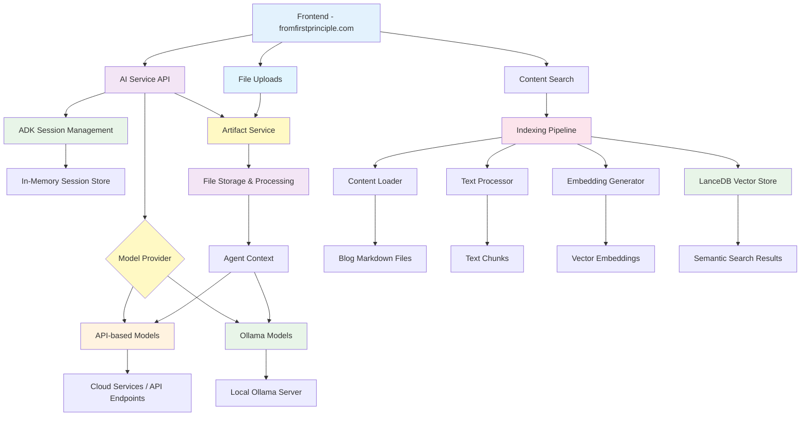

# From First Principles - AI Service


AI backend service for the From First Principles platform, providing intelligent chat capabilities and semantic content indexing powered by various AI models including local Ollama models, API-based models, or cloud-hosted services.

## Quick Start with Makefile Commands

This project includes a comprehensive Makefile that simplifies all common operations. Here are the most frequently used commands:

### Essential Commands

```bash
# Setup and Installation
make setup              # Complete project setup (environment + dependencies)
make help               # Show all available commands with descriptions

# Development
make dev                # Start development server with auto-reload
make dev-bg            # Start development server in background
make prod              # Start production server

# Server Management
make status            # Check server status
make restart           # Restart server
make stop              # Stop server
make logs              # View access logs
make logs-error        # View error logs
make health            # Check if server is responding

# Content Indexing
make index-test        # Test indexing pipeline
make index-all         # Index all blog content
make index-search      # Run example semantic search
make index-stats       # Show indexing statistics

# Testing and Quality
make test              # Run tests
make test-cov          # Run tests with coverage
make lint              # Run code linting
make format            # Format code
make clean             # Clean up temporary files
```

### Quick Development Workflow

```bash
# Initial setup
make setup

# Start developing
make dev

# In another terminal - test indexing
make index-test
make index-all

# Run tests
make test
```

## Overview

This service provides a comprehensive AI platform with two main components:

### Agent Service

A FastAPI-based backend that hosts an agent with the following functionalities:

- **Multi-Model Support**: Choose between API-based models, cloud services, or local Ollama models
- **Session Management**: Persistent conversation history across multiple interactions
- **File Upload & Artifact Service**: Support for file attachments with automatic processing and integration
- **CORS Configuration**: Secure cross-origin requests from the frontend
- **Static File Serving**: Integrated frontend serving capabilities
- **Production Ready**: Deployment scripts and production configurations

### 📚 Content Indexing System

A modern semantic search pipeline that transforms your blog content into an intelligent, searchable knowledge base:

- **🧠 Dual Search Modes**: Semantic search using AI embeddings for conceptual matching, plus traditional keyword search for exact terms
- **⚡ High Performance**: Vector similarity using LanceDB with GPU acceleration and intelligent caching
- **🎨 Modern CLI**: Beautiful `index-cli` interface with rich terminal output, progress tracking, and comprehensive help
- **🔧 Developer Friendly**: Complete Python API, detailed statistics, error handling, and extensive documentation
- **📊 Smart Processing**: Automatic text chunking, metadata extraction, and embedding generation with 384-dimensional vectors

**How it Works**: The system processes your markdown blog posts, splits them into semantic chunks, generates AI embeddings using sentence transformers, and stores everything in a high-performance vector database. This enables both conceptual similarity search ("find posts about machine learning") and exact keyword matching ("find posts mentioning 'LanceDB'").

**Perfect For**: Content discovery, research assistance, finding related articles, and building intelligent search experiences for your blog readers.

👀 **For complete technical details, architecture diagrams, and API documentation**, see the [**Indexing System Documentation**](src/indexing/README.md).

## Architecture



## Development Setup

### Prerequisites

- Python 3.11+
- uv package manager
- ngrok (for production deployment)
- AI Model Access (choose one):
  - API key for cloud-based models (e.g., OpenAI, Anthropic)
  - Cloud service account (e.g., GCP, AWS, Azure)
  - Local Ollama installation for local models

### Project Structure

```
services/ai/
├── src/
│   ├── app/                 # FastAPI chat service
│   │   ├── api/            # API endpoints
│   │   ├── core/           # Core functionality
│   │   ├── artifacts/      # File validation & processing
│   │   ├── models.py       # Data models
│   │   ├── schemas.py      # API schemas
│   │   └── main.py         # FastAPI application
│   ├── agents/             # AI model agents
│   └── indexing/           # Content indexing pipeline
│       ├── main.py         # CLI entry point
│       ├── builder.py      # Main pipeline orchestrator
│       ├── loader.py       # Markdown content loader
│       ├── embedder.py     # Vector embedding generator
│       ├── database.py     # LanceDB vector store
│       └── README.md       # Detailed indexing docs
├── data/
│   ├── content/            # Blog markdown files
│   └── lancedb/           # Vector database
├── scripts/               # Deployment scripts
└── CLI_USAGE.md          # CLI documentation
```

### Installation

1. **Clone and setup environment**:

```bash
git clone <repository-url>
cd services/ai

# Complete project setup (environment + dependencies)
make setup
```

2. **Verify installation**:

```bash
# Test the indexing pipeline
make index-test

# Show available commands
make help
```

This installs all dependencies including:

- **Chat Service**: FastAPI, ADK, session management
- **Indexing Pipeline**: sentence-transformers, LanceDB, typer, rich
- **CLI Tools**: Modern `index-cli` command with beautiful output

2. **Configure environment**:

```bash
cp .env.example .env
# Edit .env with your configuration (see Configuration section)
```

3. **Set up your AI model access**:

Choose one of the following options:

- **API Key**: Set your API key in the `.env` file for cloud-based models
- **Cloud Service**: Configure cloud service credentials according to your provider's documentation
- **Local Models**: Install and configure Ollama for local AI processing

### Configuration

Update your `.env` file with the following settings:

#### Required Settings

```bash
# Server Configuration
HOST=0.0.0.0
PORT=8081
ENVIRONMENT=development

# Model Configuration - Choose your provider
MODEL_PROVIDER=ollama  # Options: 'ollama', 'openai', 'anthropic', 'gemini', etc.

# API-based Model Settings (when using cloud/API models)
# Uncomment and configure based on your chosen provider:
# OPENAI_API_KEY=your-openai-api-key
# ANTHROPIC_API_KEY=your-anthropic-api-key
# GOOGLE_API_KEY=your-google-api-key
# GOOGLE_CLOUD_PROJECT=your-gcp-project-id
# GOOGLE_CLOUD_LOCATION=us-central1

# Ollama Settings (when MODEL_PROVIDER=ollama)
OLLAMA_API_BASE=http://localhost:11434
OLLAMA_MODEL=mistral-small3.1
OLLAMA_MODEL_PRO=llama3.2

# Authentication
AUTH_SECRET=your-super-secret-key

# Frontend URL for CORS
FRONTEND_URL=http://localhost:3000
```

> **Note**: You need to configure at least one model provider. The service uses ADK (Agent Development Kit) which can work with various AI models. Choose your preferred approach:
>
> - **Local Models**: Use Ollama for privacy and offline capability
> - **API Services**: Use cloud APIs for powerful models (requires API keys)
> - **Cloud Platforms**: Use cloud services for enterprise features (requires service accounts)

#### CORS Configuration

For production deployments, update `FRONTEND_URL` to include your production domain:

```bash
FRONTEND_URL=https://fromfirstprinciple.com,http://localhost:3000
```

For ngrok integration (see Ngrok Setup section):

```bash
FRONTEND_URL=https://your-ngrok-url.ngrok-free.app,https://fromfirstprinciple.com,http://localhost:3000
```

## AI Model Integration

The AI service supports multiple model providers through a configurable provider system. You can choose between API-based models, cloud services, or local models for private AI processing.

### Model Provider Options

#### 1. Local Models (Ollama) - Privacy & Offline

**Benefits**: Complete privacy, no API costs, offline capability, full control
**Requirements**: Local compute resources

**Setup**:

**Setup**:

1. **Install Ollama**: Download and install Ollama from [https://ollama.ai](https://ollama.ai)

2. **Start Ollama Server**:

   ```bash
   ollama serve
   ```

3. **Download Models**: Download the models you want to use:

   ```bash
   # Download recommended models with tool support
   ollama pull mistral-small3.1
   ollama pull llama3.2

   # Verify tool support
   ollama show mistral-small3.1
   ```

#### 2. API-based Models - Powerful & Convenient

**Benefits**: Access to latest models, no local compute needed, easy setup
**Requirements**: API keys, internet connection

**Popular Options**:

- **OpenAI**: GPT-4, GPT-3.5-turbo
- **Anthropic**: Claude 3, Claude 2
- **Google**: Gemini models
- **Others**: Cohere, AI21, etc.

**Setup**: Add your API key to `.env` file based on your chosen provider.

#### 3. Cloud Services - Enterprise & Scale

**Benefits**: Enterprise features, scalability, managed infrastructure
**Requirements**: Cloud service accounts, billing setup

**Options**:

- **Google Cloud Platform**: Vertex AI
- **AWS**: Bedrock
- **Azure**: OpenAI Service
- **Others**: Various cloud ML platforms

### Configuration

Example configurations for different providers:

```bash
# For Ollama (local models)
MODEL_PROVIDER=ollama
OLLAMA_API_BASE=http://localhost:11434
OLLAMA_MODEL=mistral-small3.1
OLLAMA_MODEL_PRO=llama3.2

# For OpenAI
MODEL_PROVIDER=openai
OPENAI_API_KEY=your-openai-api-key

# For Anthropic
MODEL_PROVIDER=anthropic
ANTHROPIC_API_KEY=your-anthropic-api-key

# For Google Gemini
MODEL_PROVIDER=gemini
GOOGLE_API_KEY=your-google-api-key
```

### Available Models

#### Local Models (Ollama)

- `mistral-small3.1`: Mistral Small with tool support
- `llama3.2`: Meta Llama 3.2 with tool support
- `codellama`: Code-focused model
- `neural-chat`: Optimized for conversations

#### API-based Models

- **OpenAI**: `gpt-4`, `gpt-3.5-turbo`
- **Anthropic**: `claude-3-opus`, `claude-3-sonnet`
- **Google**: `gemini-pro`, `gemini-pro-vision`
- **Others**: Configurable based on provider

### Model Selection

The system automatically selects models based on the provider configuration:

- **Default Model**: Used for standard operations
- **Pro Model**: Used for complex reasoning (agents use this)

Configure your preferred models in the `.env` file based on your chosen provider.

### Switching Between Providers

Update your `.env` file with the desired provider:

```bash
# For local privacy
MODEL_PROVIDER=ollama

# For API access
MODEL_PROVIDER=openai
# or
MODEL_PROVIDER=anthropic
```

After changing the provider, restart the service:

```bash
make restart
```

### Testing Model Integration

Run the integration test to verify everything works:

```bash
# Test your configured model provider
python tests/test_integration.py

# Or run the specific model integration test
python tests/test_model_integration.py
```

### Model Integration Troubleshooting

#### Common Issues

1. **"Failed to create model"**

   - **For Ollama**: Ensure Ollama is running: `ollama serve`
   - **For API models**: Check your API key is valid and has sufficient quota
   - **For Cloud services**: Verify authentication and service permissions

2. **Model not found errors**

   - **For Ollama**: Check the model is available: `ollama list`
   - **For API models**: Verify model name matches provider's available models
   - **For Cloud services**: Ensure the model is available in your region

3. **Authentication issues**
   - **For API models**: Verify API key format and permissions
   - **For Cloud services**: Check service account credentials and roles

#### Model Recommendations

**For Tool Support**:

- **Ollama**: Mistral Small 3.1, Llama 3.2
- **OpenAI**: GPT-4, GPT-3.5-turbo
- **Anthropic**: Claude 3 models
- **Google**: Gemini Pro models

**For Performance**:

- **Fast responses**: Use smaller, optimized models
- **Complex reasoning**: Use larger, more capable models
- **Local privacy**: Ollama models with adequate local resources

#### Performance Notes

- **Local models**: Provide privacy but require local compute resources
- **API models**: Fast and powerful but require internet and API costs
- **Cloud services**: Enterprise features but more complex setup
- **First requests**: May be slower as models initialize

### Running the Service

#### Development Mode

```bash
make dev
```

#### Development Mode (Background)

```bash
make dev-bg
```

#### Production Mode

```bash
make prod
```

#### Production with Custom Workers

```bash
make prod-workers WORKERS=8
```

The service will be available at:

- **API Documentation**: `http://localhost:8081/docs`
- **Health Check**: `http://localhost:8081/api/v1/health`
- **Chat Endpoint**: `http://localhost:8081/api/v1/root_agent/`

#### Service Management

```bash
# Check server status
make status

# Stop service
make stop

# Restart service
make restart

# View logs
make logs           # Access logs
make logs-error     # Error logs
make logs-all       # Both logs

# Server health check
make health
```

## Ngrok Integration

For exposing your local AI service to the internet (useful for production frontend testing):

### Setup Steps

1. **Start the AI service**:

```bash
make prod
```

2. **Start ngrok tunnel**:

```bash
ngrok http 8081
```

3. **Update CORS configuration**:

```bash
# In .env file
FRONTEND_URL=https://abc123.ngrok-free.app,https://fromfirstprinciple.com,http://localhost:3000
```

4. **Restart the service**:

```bash
make restart
```

5. **Update frontend configuration**:

```bash
# In frontend .env.local
NEXT_PUBLIC_API_BASE_URL=https://abc123.ngrok-free.app
```

### Testing Ngrok Setup

```bash
./tests/test_ngrok_setup.sh
```

### Frontend Integration Script

Use the utility script to easily switch between local and ngrok configurations:

```bash
cd ../frontend
./scripts/switch-api-config.sh ngrok   # Switch to ngrok
./scripts/switch-api-config.sh local   # Switch to local
```

## File Upload & Artifact Service

The AI service includes a comprehensive file upload and artifact management system that allows users to attach files to their conversations. These files are automatically processed, stored as artifacts, and made available to the AI agent for analysis and interaction.

### Features

- **Multi-File Upload**: Support for uploading multiple files simultaneously
- **Automatic File Processing**: Files are automatically validated, processed, and stored as artifacts
- **MIME Type Detection**: Intelligent detection of file types based on content and filename
- **Session Integration**: Files are associated with user sessions for context preservation
- **Agent Access**: Uploaded files are immediately available to AI agents for processing
- **Unique Naming**: Automatic filename generation to prevent conflicts
- **File Validation**: Built-in validation to ensure file safety and compatibility

### Supported File Types

The artifact service supports a wide range of file types:

#### Text Files

- **Markdown**: `.md`, `.markdown`
- **Plain Text**: `.txt`
- **Code Files**: `.py`, `.js`, `.ts`, `.jsx`, `.tsx`, `.html`, `.css`, `.json`, `.yaml`, `.yml`

#### Document Files

- **PDF**: `.pdf`
- **Microsoft Office**: `.docx`, `.xlsx`, `.pptx`
- **OpenDocument**: `.odt`, `.ods`, `.odp`
- **RTF**: `.rtf`

#### Image Files

- **Common Formats**: `.jpg`, `.jpeg`, `.png`, `.gif`, `.bmp`, `.webp`
- **Vector Graphics**: `.svg`
- **RAW Formats**: `.tiff`, `.tif`

#### Data Files

- **Spreadsheets**: `.csv`, `.tsv`
- **Structured Data**: `.json`, `.xml`
- **Configuration**: `.ini`, `.conf`, `.config`

### API Usage

#### File Upload Endpoint

The main chat endpoint supports file uploads via multipart/form-data:

```http
POST /api/v1/root_agent/
Content-Type: multipart/form-data

Form Fields:
- text: "Your message text" (optional if files provided)
- model: "gpt-4" (optional)
- files: [file1, file2, ...] (one or more files)
```

#### Request Examples

**Text with Files**:

```bash
curl -X POST "http://localhost:8081/api/v1/root_agent/" \
  -H "X-Session-ID: your-session-id" \
  -F "text=Please analyze these documents" \
  -F "files=@document1.pdf" \
  -F "files=@data.csv" \
  -F "model=gpt-4"
```

**Files Only**:

```bash
curl -X POST "http://localhost:8081/api/v1/root_agent/" \
  -H "X-Session-ID: your-session-id" \
  -F "files=@image.png" \
  -F "files=@report.docx"
```

#### Response Format

```json
{
  "response": "I've analyzed your uploaded files. The PDF document contains...",
  "references": {},
  "session_id": "uuid-session-id",
  "model": "gpt-4",
  "confidence": null
}
```

### Frontend Integration

The frontend automatically handles file uploads through the chat interface:

#### File Selection

- Users can click the "+" button to select files
- Multiple files can be selected simultaneously
- Files are displayed as chips with name and size
- Individual files can be removed before sending

#### File Display

```typescript
// Files are shown as removable chips
<FileChip
  fileName={file.name}
  fileSize={file.size}
  fileType={file.type}
  onRemove={() => handleRemoveFile(id)}
/>
```

#### API Integration

```typescript
// Frontend sends files with text
const response = await sendMessage(userMessage, files, {
  signal: abortController.signal,
  model: selectedModel,
});
```

### Artifact Storage Architecture

#### Storage Flow

1. **Upload**: Files uploaded via multipart/form-data
2. **Validation**: MIME type detection and file validation
3. **Processing**: Unique filename generation with timestamp and UUID
4. **Storage**: Files stored as ADK artifacts in session context
5. **Integration**: Artifacts immediately available to AI agents

#### Filename Generation

```python
# Generated filename format
timestamp = int(time.time())
unique_id = str(uuid.uuid4())[:8]
artifact_filename = f'{timestamp}_{unique_id}_{original_filename}'
```

#### Session Association

```python
# Files are stored per session and user
await artifact_service.save_artifact(
    app_name=config.app_name,
    user_id=config.user_id,
    session_id=session_id,
    filename=artifact_filename,
    artifact=artifact_part,
)
```

### Agent Integration

Uploaded files are automatically available to AI agents through the ADK artifact system:

#### Agent Access Pattern

```python
# Agents can access uploaded files through the session context
# Files are provided as ADK Part objects with proper MIME types
# The agent can process text, images, documents, and data files
```

#### Processing Capabilities

- **Text Analysis**: Read and analyze document contents
- **Image Recognition**: Process and describe images
- **Data Processing**: Analyze CSV, JSON, and structured data
- **Code Review**: Examine and provide feedback on code files
- **Document Summarization**: Extract key information from PDFs and documents

### Configuration

#### File Validation Settings

```python
# File validator configuration
class FileValidator:
    def __init__(self):
        self.max_file_size = 10 * 1024 * 1024  # 10MB default
        self.allowed_mime_types = {
            'text/plain', 'text/markdown', 'application/pdf',
            'image/jpeg', 'image/png', 'text/csv', ...
        }
```

#### Environment Variables

```bash
# Optional file upload configuration
MAX_FILE_SIZE=10485760  # 10MB in bytes
ALLOWED_FILE_TYPES=pdf,txt,md,csv,json,png,jpg  # Comma-separated
```

### Error Handling

#### Common Error Responses

**No Content Provided**:

```json
{
  "detail": "Must provide either text message or file attachments",
  "status_code": 400
}
```

**File Validation Failed**:

```json
{
  "detail": "Uploaded file 'document.exe' has invalid type",
  "status_code": 400
}
```

**File Too Large**:

```json
{
  "detail": "File size exceeds maximum limit of 10MB",
  "status_code": 413
}
```

### Security Considerations

#### File Validation

- MIME type validation based on file content, not just extension
- File size limits to prevent abuse
- Filename sanitization to prevent path traversal
- Session-based access control

#### Storage Security

- Files are stored per session and user
- Unique filename generation prevents conflicts
- Files are not directly accessible via HTTP
- Automatic cleanup of expired sessions

### Performance Optimization

#### Efficient Processing

- Streaming file uploads for large files
- Asynchronous file processing
- MIME type detection using python-magic
- Batch processing for multiple files

#### Memory Management

- Files processed in chunks to minimize memory usage
- Automatic garbage collection of processed files
- Session-based artifact cleanup

### Development Examples

#### Testing File Uploads

**Python Test**:

```python
import requests

# Upload files with message
files = {
    'files': ('test.txt', open('test.txt', 'rb'), 'text/plain'),
    'files': ('data.csv', open('data.csv', 'rb'), 'text/csv')
}
data = {
    'text': 'Please analyze these files',
    'model': 'gpt-4'
}

response = requests.post(
    'http://localhost:8080/api/v1/root_agent/',
    files=files,
    data=data,
    headers={'X-Session-ID': 'test-session'}
)
```

**JavaScript Test**:

```javascript
const formData = new FormData();
formData.append("text", "Analyze this document");
formData.append("files", fileInput.files[0]);
formData.append("model", "claude-3-sonnet");

const response = await fetch("/api/v1/root_agent/", {
  method: "POST",
  headers: {
    "X-Session-ID": sessionId,
  },
  body: formData,
});
```

### Monitoring and Debugging

#### Logging

File upload operations are logged with detailed information:

```
2025-01-17 10:30:45 | INFO | Received file upload: document.pdf (1.2MB)
2025-01-17 10:30:45 | INFO | File validated successfully: application/pdf
2025-01-17 10:30:45 | INFO | Artifact saved: 1737123045_abc12345_document.pdf
2025-01-17 10:30:45 | INFO | File available to agent for session: uuid-session-id
```

#### Health Checks

```bash
# Test file upload functionality
curl -X POST "http://localhost:8081/api/v1/root_agent/" \
  -F "text=test" \
  -F "files=@small-test-file.txt"

# Or use the health check command
make health
```

### Troubleshooting

#### Common Issues

**"Must provide either text message or file attachments"**:

- Ensure at least one of `text` or `files` is provided
- Check that form fields are properly named

**"File type not supported"**:

- Verify file type is in the supported list
- Check MIME type detection is working correctly

**"File too large"**:

- Reduce file size or increase `MAX_FILE_SIZE` limit
- Consider splitting large files into smaller chunks

**Files not accessible to agent**:

- Verify session ID consistency between requests
- Check artifact service initialization
- Ensure proper session middleware configuration

### Chat Endpoint

The main endpoint supports both text messages and file uploads via multipart/form-data:

```http
POST /api/v1/root_agent/
Content-Type: multipart/form-data

Form Fields:
- text: "Your message here" (optional if files provided)
- model: "gpt-4" (optional)
- files: [file1, file2, ...] (optional)
```

**Legacy JSON Support** (for backwards compatibility):

```http
POST /api/v1/root_agent/
Content-Type: application/json

{
  "text": "Your message here",
  "model": "claude-3-sonnet"  // optional
}
```

**Response Format**:

```json
{
  "response": "AI response",
  "references": {},
  "session_id": "uuid",
  "model": "claude-3-sonnet",
  "confidence": null
}
```

### Available Models

```http
GET /api/v1/root_agent/models
```

### Programmatic Model Usage

```python
from agents.model_factory import create_model, get_default_model, get_pro_model

# Create specific models based on your provider
openai_model = create_model('gpt-4')
anthropic_model = create_model('claude-3-sonnet')
ollama_model = create_model('mistral-small3.1')

# Get models based on current provider configuration
default_model = get_default_model()
pro_model = get_pro_model()
```

### Health Check

```bash
# Using Make command
make health

# Or direct API call
GET /api/v1/health
```

## Session Management

The service uses ADK (Agent Development Kit) for session management, providing:

- **Persistent conversations**: Chat history maintained across requests
- **Session isolation**: Each session has its own conversation context
- **Automatic session creation**: New sessions created as needed
- **Memory management**: Efficient in-memory session storage

## Security

- **CORS Protection**: Configured to only allow requests from specified origins
- **Session validation**: Secure session ID generation and validation
- **Environment isolation**: Sensitive configuration in environment variables
- **Input validation**: Request validation using Pydantic models

## Deployment

### Production Deployment

```bash
make prod
```

### Service Management

```bash
# Check status
make status

# Stop service
make stop

# Restart service
make restart

# View logs
make logs
make logs-error
make logs-all
```

### Testing and Development

```bash
# Run tests
make test

# Run tests with coverage
make test-cov

# Run linting
make lint

# Format code
make format

# Run all checks
make check

# Clean up temporary files
make clean
```

## Troubleshooting

### Common Issues

#### CORS Errors

- Ensure frontend domain is in `FRONTEND_URL`
- Restart service after updating environment
- Check browser developer tools for specific CORS errors

#### Connection Issues

- Verify service is running: `make health` or `curl http://localhost:8081/api/v1/health`
- Check logs: `make logs-error`
- Ensure port is not in use: `lsof -i :8081`

#### Ngrok Issues

- Verify tunnel is active: `curl http://127.0.0.1:4040/api/tunnels`
- Test local service first before testing ngrok
- Monitor ngrok connections at: `http://127.0.0.1:4040`

### Logs

Service logs are available in the `logs/` directory:

- `access.log`: HTTP request logs
- `error.log`: Error and debug logs

Use Makefile commands for easy log viewing:

```bash
make logs           # View access logs (tail -f)
make logs-error     # View error logs (tail -f)
make logs-all       # View both logs simultaneously
```

## Makefile Tips

The included Makefile provides color-coded output and helpful descriptions for all commands:

```bash
# See all available commands with descriptions
make help

# Get command-specific help
make index-help

# Quick project reset (stop server, clean files)
make reset
```

All Makefile commands automatically handle:

- Virtual environment activation
- Dependency installation checks
- Environment validation
- Error handling with colored output

4. **Quick Start**:

```bash
# Complete setup and start development
make quick-start

# Or step by step:
make setup              # Install dependencies and setup environment
make dev                # Start development server
make index-test         # Test indexing pipeline
make index-all          # Index blog content
make index-search       # Search indexed content
```

## Content Indexing CLI

The AI service includes a modern command-line interface for indexing and searching blog content using semantic embeddings.

### Quick Start

```bash
# Test the indexing pipeline
make index-test

# Index all content
make index-all

# Search content
make index-search

# View statistics
make index-stats
```

### Installation

The CLI is automatically available after installing project dependencies:

```bash
make setup
```

### Available Commands

All indexing commands are available through the Makefile:

- **`make index-test`** - Test pipeline configuration and dependencies
- **`make index-all`** - Index all blog content
- **`make index-blog`** - Index only blog category content
- **`make index-engineering`** - Index only engineering category content
- **`make index-stats`** - Show indexing statistics and database info
- **`make index-search`** - Run example semantic search
- **`make index-search-keyword`** - Run example keyword search
- **`make index-clear`** - Clear index data with confirmation prompts
- **`make index-browse`** - Browse indexed data
- **`make index-sample`** - Show random data samples
- **`make index-inspect POST=slug`** - Inspect specific post
- **`make index-help`** - Show indexing CLI help

### Features

- 🎨 **Beautiful Output**: Rich terminal formatting with colors, tables, and progress bars
- 🔍 **Smart Search**: Semantic similarity search using sentence transformers
- ⚡ **Performance**: Efficient vector database with LanceDB and intelligent caching
- 🛠 **Developer Friendly**: Comprehensive error handling and detailed statistics

### Examples

```bash
# Complete workflow
make index-test
make index-all
make index-search

# Category-specific operations
make index-blog
make index-engineering

# Inspect specific content
make index-inspect POST=abstraction

# Development workflow
make index-clear
make index-blog
```

For detailed CLI usage information, run `make index-help` or see [CLI_USAGE.md](CLI_USAGE.md).

## Indexing Package (`src/indexing/`)

The indexing package provides a complete semantic search solution with dual search modes (semantic AI similarity and keyword text matching), modern CLI tooling, and high-performance vector storage.

### Quick Overview

```bash
# Test your setup
make index-test

# Index all blog content
make index-all

# Semantic search (AI-powered)
make index-search

# Keyword search (text matching) - using CLI directly
index-cli search "exact phrase" --mode keyword

# View system statistics
make index-stats
```

### Architecture Highlights

- **🧠 Semantic Search**: AI embeddings with vector similarity for conceptual matching
- **🔤 Keyword Search**: Traditional text search with frequency scoring and term matching
- **⚡ High Performance**: LanceDB vector database with GPU acceleration
- **🎨 Modern CLI**: Rich terminal interface with progress bars and colored output
- **📊 Smart Processing**: Intelligent chunking, metadata extraction, and batch operations

### Use Cases

- **Content Discovery**: Help users find relevant blog posts by meaning
- **Research Assistant**: Semantic search for writing and research workflows
- **SEO Enhancement**: Better content organization and related post suggestions
- **Developer Tools**: API integration for building custom search experiences

📖 **For complete technical documentation, process flow diagrams, search mode comparisons, and API reference**, see the [**Indexing System Documentation**](src/indexing/README.md).

## Contributing

1. Fork the repository
2. Create a feature branch
3. Make your changes
4. Test thoroughly
5. Submit a pull request

## License

Copyright 2025 Loïc Muhirwa

Licensed under the Apache License, Version 2.0
