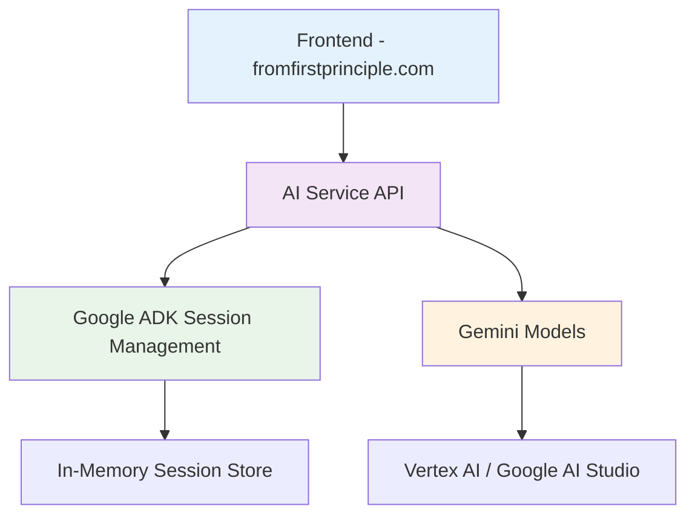

# From First Principles - AI Service


AI backend service for the From First Principles platform, providing intelligent chat capabilities powered by Google's Gemini models.

## Overview

This service provides a FastAPI-based backend that powers the AI chat functionality for the From First Principles website. It features:

- **Gemini AI Integration**: Powered by Google's latest Gemini 2.5 Flash and Pro models
- **Session Management**: Persistent conversation history across multiple interactions
- **CORS Configuration**: Secure cross-origin requests from the frontend
- **Static File Serving**: Integrated frontend serving capabilities
- **Production Ready**: Deployment scripts and production configurations

## Architecture



## Development Setup

### Prerequisites

- Python 3.11+
- uv package manager
- Google Cloud CLI (for Vertex AI)
- ngrok (for production deployment)

### Installation

1. **Install dependencies**:
```bash
uv venv
uv sync
```

2. **Configure environment**:
```bash
cp .env.example .env
# Edit .env with your configuration (see Configuration section)
```

3. **Set up Google Cloud authentication**:
```bash
gcloud auth application-default login
```

### Configuration

Update your `.env` file with the following settings:

#### Required Settings
```bash
# Server Configuration
HOST=0.0.0.0
PORT=8081
ENVIRONMENT=development

# Google Cloud Settings
GOOGLE_CLOUD_PROJECT=your-gcp-project-id
GOOGLE_CLOUD_LOCATION=us-central1
GOOGLE_API_KEY=your-google-api-key

# Authentication
AUTH_SECRET=your-super-secret-key

# Frontend URL for CORS
FRONTEND_URL=http://localhost:3000
```

#### CORS Configuration
For production deployments, update `FRONTEND_URL` to include your production domain:
```bash
FRONTEND_URL=https://fromfirstprinciple.com,http://localhost:3000
```

For ngrok integration (see Ngrok Setup section):
```bash
FRONTEND_URL=https://your-ngrok-url.ngrok-free.app,https://fromfirstprinciple.com,http://localhost:3000
```

### Running the Service

#### Development Mode
```bash
./scripts/deploy-server.sh start --dev
```

#### Production Mode
```bash
./scripts/deploy-server.sh start --port 8080
```

The service will be available at:
- **API Documentation**: `http://localhost:8080/docs`
- **Health Check**: `http://localhost:8080/api/v1/health`
- **Chat Endpoint**: `http://localhost:8080/api/v1/root_agent/`

## Ngrok Integration

For exposing your local AI service to the internet (useful for production frontend testing):

### Setup Steps

1. **Start the AI service**:
```bash
./scripts/deploy-server.sh start --port 8080
```

2. **Start ngrok tunnel**:
```bash
ngrok http 8080
```

3. **Update CORS configuration**:
```bash
# In .env file
FRONTEND_URL=https://abc123.ngrok-free.app,https://fromfirstprinciple.com,http://localhost:3000
```

4. **Restart the service**:
```bash
./scripts/deploy-server.sh restart --port 8080
```

5. **Update frontend configuration**:
```bash
# In frontend .env.local
NEXT_PUBLIC_API_BASE_URL=https://abc123.ngrok-free.app
```

### Testing Ngrok Setup
```bash
./tests/test_ngrok_setup.sh
```

### Frontend Integration Script
Use the utility script to easily switch between local and ngrok configurations:
```bash
cd ../webui_react
./scripts/switch-api-config.sh ngrok   # Switch to ngrok
./scripts/switch-api-config.sh local   # Switch to local
```

## API Endpoints

### Chat Endpoint
```http
POST /api/v1/root_agent/
Content-Type: application/json

{
  "text": "Your message here",
  "model": "gemini-2.5-flash"  // optional
}
```

Response:
```json
{
  "response": "AI response",
  "references": {},
  "session_id": "uuid",
  "model": "gemini-2.5-flash",
  "confidence": null
}
```

### Available Models
```http
GET /api/v1/root_agent/models
```

### Health Check
```http
GET /api/v1/health
```

## Session Management

The service uses Google ADK for session management, providing:
- **Persistent conversations**: Chat history maintained across requests
- **Session isolation**: Each session has its own conversation context
- **Automatic session creation**: New sessions created as needed
- **Memory management**: Efficient in-memory session storage

## Security

- **CORS Protection**: Configured to only allow requests from specified origins
- **Session validation**: Secure session ID generation and validation
- **Environment isolation**: Sensitive configuration in environment variables
- **Input validation**: Request validation using Pydantic models

## Deployment

### Production Deployment
```bash
./scripts/deploy-server.sh start
```

### Service Management
```bash
# Check status
./scripts/deploy-server.sh status

# Stop service
./scripts/deploy-server.sh stop

# Restart service
./scripts/deploy-server.sh restart

# View logs
tail -f logs/access.log
tail -f logs/error.log
```

## Troubleshooting

### Common Issues

#### CORS Errors
- Ensure frontend domain is in `FRONTEND_URL`
- Restart service after updating environment
- Check browser developer tools for specific CORS errors

#### Connection Issues
- Verify service is running: `curl http://localhost:8080/api/v1/health`
- Check logs: `tail -f logs/error.log`
- Ensure port is not in use: `lsof -i :8080`

#### Ngrok Issues
- Verify tunnel is active: `curl http://127.0.0.1:4040/api/tunnels`
- Test local service first before testing ngrok
- Monitor ngrok connections at: `http://127.0.0.1:4040`

### Logs
Service logs are available in the `logs/` directory:
- `access.log`: HTTP request logs
- `error.log`: Error and debug logs

## Contributing

1. Fork the repository
2. Create a feature branch
3. Make your changes
4. Test thoroughly
5. Submit a pull request

## License

Copyright 2025 Loïc Muhirwa

Licensed under the Apache License, Version 2.0
