# Agent Orchestration


Backend service that coordinates AI agents for the AgentChat system.

## System Architecture

### High-Level Architecture

The following diagram illustrates the high-level architecture of the agent orchestration system:


### Multi-Model Conversation Continuity

One elegant feature of this system is **seamless model switching mid-conversation**. Users can switch between different AI models (e.g., Gemini 2.5 Flash ↔ Gemini 2.5 Pro) while maintaining complete conversation history and context.

#### How It Works

Our architecture leverages Google ADK's session management to provide true conversation continuity across different models:

```mermaid
graph TB
    subgraph "Frontend"
        UI[User Interface]
        MS[Model Selector]
    end

    subgraph "Backend - FastAPI"
        EP[Agent Endpoint]
        AF[Agent Factory]
        DEP[Dependencies]
    end

    subgraph "Google ADK Session Layer"
        SS[Session Service<br/>📝 Shared Memory]
        SES[Session<br/>🆔 c5e10550-...]
    end

    subgraph "Model-Specific Runners"
        R1[Runner: Flash<br/>🏃‍♂️ Cached]
        R2[Runner: Pro<br/>🏃‍♂️ Cached]
        A1[Agent: Flash<br/>🤖 LRU Cached]
        A2[Agent: Pro<br/>🤖 LRU Cached]
    end

    subgraph "Google Vertex AI"
        V1[Gemini 2.5 Flash]
        V2[Gemini 2.5 Pro]
    end

    UI --> |"Switch Model"| MS
    MS --> |"model: gemini-2.5-pro"| EP
    EP --> |"Get Agent"| AF
    AF --> |"LRU Cache"| A1
    AF --> |"LRU Cache"| A2
    EP --> |"Get Runner"| DEP
    DEP --> |"Create if needed"| R1
    DEP --> |"Create if needed"| R2

    R1 --> |"SAME session_service"| SS
    R2 --> |"SAME session_service"| SS
    SS --> |"SAME session_id"| SES

    R1 --> |"Model-specific"| A1
    R2 --> |"Model-specific"| A2
    A1 --> V1
    A2 --> V2

    SES --> |"📚 Full History<br/>Auto-loaded"| R1
    SES --> |"📚 Full History<br/>Auto-loaded"| R2

    style SS fill:#e1f5fe,stroke:#0277bd,stroke-width:3px
    style SES fill:#f3e5f5,stroke:#7b1fa2,stroke-width:2px
    style R1 fill:#e8f5e8,stroke:#2e7d32,stroke-width:2px
    style R2 fill:#fff3e0,stroke:#ef6c00,stroke-width:2px
    style AF fill:#fce4ec,stroke:#c2185b,stroke-width:2px
```



#### Key Architecture Components

1. **Agent Factory Pattern**

   ```python
   @lru_cache(maxsize=10)
   def get_agent(self, model_name: str) -> Agent:
       # Creates and caches model-specific agents
   ```

2. **Runner Management**

   ```python
   runner_key = f'runner_{model_name.replace("-", "_").replace(".", "_")}'
   if not hasattr(request.app.state, runner_key):
       runner = Runner(
           agent=agent,                                    # Model-specific
           app_name=config.app_name,                      # Shared
           session_service=request.app.state.session_service,  # 🔑 THE MAGIC
       )
   ```

3. **Shared Session Service**
   - **Single Session ID**: All models use the same session identifier
   - **Automatic History Loading**: ADK automatically provides full conversation context
   - **Seamless Continuity**: Users experience uninterrupted conversations

#### Benefits

✅ **True Conversation Continuity**: Switch models without losing context
✅ **Performance Optimization**: Cached runners and agents for fast switching
✅ **Model-Specific Capabilities**: Each model maintains its unique characteristics
✅ **Unified Memory**: Shared session service ensures consistent experience

The diagram shows the interaction between different components of the system:

- User Interaction: How users interact with different AI agents
- Core Agent System: The orchestrator that routes requests to appropriate agents
- Multi-Model Support: Various AI models and their APIs
- Tool Integration: Specialized capabilities available to each agent

## Development Setup

### Prerequisites

- Python 3.13+
- uv package manager
- Google Cloud CLI
- Access to GCP project with enabled APIs:
  - Vertex AI
  - BigQuery
  - Cloud Storage

### Environment Setup

```bash
# Install uv if not already installed
pip install uv

# Create virtual environment and install dependencies
uv venv
uv sync
```

### Configuration

1. Set up Google Cloud authentication:

```bash
gcloud auth application-default login
```

2. Configure environment variables:

```bash
# Copy the example environment file
cp .env.example .env

# Open the .env file and update the following variables:
# - GOOGLE_CLOUD_PROJECT: Your GCP project ID
# - GOOGLE_CLOUD_LOCATION: Your GCP region (e.g., us-central1)
# - FRONTEND_URL: Your frontend URL (default: http://localhost:3000)
# - GOOGLE_CSE_ID: Your Google Custom Search Engine ID (if using)
# - CUSTOM_SEARCH_API_KEY: Your Custom Search API key (if using)
```

For the Vertex AI configuration, ensure `GOOGLE_GENAI_USE_VERTEXAI=TRUE` is set in your `.env` file to use Vertex AI API through your GCP project.

If you prefer to use the Google AI Studio API directly, set `GOOGLE_GENAI_USE_VERTEXAI=FALSE` and provide your `GOOGLE_API_KEY`.

### Running the Server

Start the development server:

```bash
uvicorn src.app.main:app --reload --host 0.0.0.0 --port 8000
```

The server will be available at `http://localhost:8000`. The `--reload` flag enables auto-reloading when code changes are detected during development.
