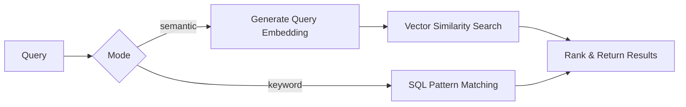

# Content Indexing Pipeline

A modern, semantic search indexing system for blog content using vector embeddings and LanceDB.

## Overview

This module provides a complete pipeline for:

- **Content Loading**: Parse markdown files with frontmatter metadata
- **Text Processing**: Intelligent chunking with overlap for better context
- **Embedding Generation**: Semantic vectors using sentence transformers
- **Vector Storage**: Efficient indexing with LanceDB vector database
- **Semantic Search**: Similarity-based content retrieval

## Architecture

```
┌─────────────────┐    ┌──────────────────┐    ┌─────────────────┐
│   Content       │    │   Text           │    │   Embedding     │
│   Loader        │───▶│   Processor      │───▶│   Generator     │
│                 │    │                  │    │                 │
└─────────────────┘    └──────────────────┘    └─────────────────┘
         │                       │                       │
         ▼                       ▼                       ▼
┌─────────────────┐    ┌──────────────────┐    ┌─────────────────┐
│   Document      │    │   Content        │    │   Embedding     │
│   Metadata      │    │   Chunks         │    │   Vectors       │
└─────────────────┘    └──────────────────┘    └─────────────────┘
         │                       │                       │
         └───────────────────────┼───────────────────────┘
                                 ▼
                    ┌──────────────────┐
                    │    LanceDB       │
                    │  Vector Store    │
                    └──────────────────┘
```

## Process Flows

### Indexing Pipeline


```mermaid
flowchart LR
    A[Content Directory] --> B[Load & Validate Markdown]
    B --> C[Parse Frontmatter & Extract Metadata]
    C --> D[Split into Chunks]
    D --> E[Generate Embeddings]
    E --> F[Store in LanceDB]
```

### Search


```mermaid
flowchart LR
    A[Query] --> B{Mode}
    B -->|semantic| C[Generate Query Embedding]
    C --> D[Vector Similarity Search]
    D --> F[Rank & Return Results]
    B -->|keyword| E[SQL Pattern Matching]
    E --> F
```

## Search Modes

| Aspect         | Semantic                                 | Keyword                               |
| -------------- | ---------------------------------------- | ------------------------------------- |
| **Matching**   | Conceptual similarity                    | Exact text matching                   |
| **Technology** | Embeddings + vector similarity           | SQL LIKE patterns + frequency scoring |
| **Strengths**  | Finds related concepts, handles synonyms | Fast, predictable, exact matches      |
| **Best for**   | Exploratory search, concepts, ideas      | Specific terms, names, exact phrases  |

## Quick Start

### CLI

```bash
index-cli test                                        # verify setup
index-cli index                                       # index all content
index-cli search "machine learning"                   # semantic search (default)
index-cli search "exact phrase" --mode keyword         # keyword search
index-cli search "AI concepts" --limit 10 --threshold 0.3
```

### Python API

```python
from indexing import IndexingPipeline, IndexingConfig

pipeline = IndexingPipeline(IndexingConfig())

# Index content
stats = pipeline.index_all_content()
print(f"Indexed {stats.chunks_created} chunks from {stats.posts_processed} posts")

# Semantic search
for result in pipeline.search("productivity tips", limit=5):
    print(f"{result['score']:.3f} - {result['title']}")

# Keyword search
for result in pipeline.keyword_search("exact phrase", limit=5):
    print(f"{result['score']:.3f} - {result['title']} ({result['term_matches']} matches)")
```

## Components

| Module                     | Purpose                                                    |
| -------------------------- | ---------------------------------------------------------- |
| `loader.py`                | Markdown parsing, frontmatter extraction                   |
| `utils/text_processing.py` | Token-aware chunking with overlap                          |
| `embedder.py`              | Embedding generation (`all-MiniLM-L6-v2`, 384-dim vectors) |
| `builder.py`               | End-to-end pipeline orchestration                          |
| `config.py`                | Centralized configuration with auto device detection       |

## Configuration

```python
class IndexingConfig:
    content_base_dir = "data/content"
    database_path = "data/lancedb"
    embedding_model = "all-MiniLM-L6-v2"
    embedding_device = "auto"       # auto-detects CPU/CUDA/MPS
    chunk_size = 512                # tokens per chunk
    chunk_overlap = 50
    default_limit = 10
    similarity_threshold = 0.3
```

Override defaults as needed:

```python
config = IndexingConfig()
config.embedding_model = "all-mpnet-base-v2"
config.chunk_size = 1024
config.database_path = "custom/db/path"
pipeline = IndexingPipeline(config)
```

## Testing

```bash
pytest tests/indexing/        # unit tests
index-cli test                # integration smoke test
```

## Troubleshooting

| Problem                   | Solution                                                                                                     |
| ------------------------- | ------------------------------------------------------------------------------------------------------------ |
| Model download failure    | `python -c "from sentence_transformers import SentenceTransformer; SentenceTransformer('all-MiniLM-L6-v2')"` |
| Database permission error | `chmod -R 755 data/lancedb/`                                                                                 |
| High memory usage         | Reduce `config.batch_size` (default 16)                                                                      |
| Slow performance          | Set `config.embedding_device = "cpu"` for consistent throughput                                              |

## Dependencies

| Category | Packages                                                                         |
| -------- | -------------------------------------------------------------------------------- |
| Core     | `lancedb`, `sentence-transformers`, `langchain-text-splitters`, `markdown-it-py` |
| CLI      | `typer`, `rich`                                                                  |
| Optional | `torch` (GPU acceleration), `psutil` (system monitoring)                         |
