# Content Indexing Pipeline

A modern, semantic search indexing system for blog content using vector embeddings and LanceDB.

## Overview

This module provides a complete pipeline for:

- **Content Loading**: Parse markdown files with frontmatter metadata
- **Text Processing**: Intelligent chunking with overlap for better context
- **Embedding Generation**: Semantic vectors using sentence transformers
- **Vector Storage**: Efficient indexing with LanceDB vector database
- **Semantic Search**: Similarity-based content retrieval

## Architecture

```
┌─────────────────┐    ┌──────────────────┐    ┌─────────────────┐
│   Content       │    │   Text           │    │   Embedding     │
│   Loader        │───▶│   Processor      │───▶│   Generator     │
│                 │    │                  │    │                 │
└─────────────────┘    └──────────────────┘    └─────────────────┘
         │                       │                       │
         ▼                       ▼                       ▼
┌─────────────────┐    ┌──────────────────┐    ┌─────────────────┐
│   Document      │    │   Content        │    │   Embedding     │
│   Metadata      │    │   Chunks         │    │   Vectors       │
└─────────────────┘    └──────────────────┘    └─────────────────┘
         │                       │                       │
         └───────────────────────┼───────────────────────┘
                                 ▼
                    ┌──────────────────┐
                    │    LanceDB       │
                    │  Vector Store    │
                    └──────────────────┘
```

## Detailed Process Flows

### Indexing Pipeline

```mermaid
flowchart TD
    A[📁 Content Directory] --> B[📄 Load Markdown Files]
    B --> C{Valid Markdown?}
    C -->|No| D[⚠️ Skip File]
    C -->|Yes| E[📝 Parse Frontmatter]
    E --> F[🔍 Extract Metadata]
    F --> G[📖 Extract Content]
    G --> H[✂️ Split into Chunks]
    H --> I[🧠 Generate Embeddings]
    I --> J[💾 Store in LanceDB]
    J --> K[📊 Update Statistics]
    K --> L[✅ Indexing Complete]

    style A fill:#e1f5fe
    style E fill:#f3e5f5
    style I fill:#fff3e0
    style J fill:#e8f5e8
    style L fill:#e8f5e8
```



### Text Processing Pipeline

```mermaid
flowchart TD
    A[📖 Raw Markdown Content] --> B[🧹 Clean Text]
    B --> C[📏 Measure Token Length]
    C --> D{Length > Chunk Size?}
    D -->|No| E[Single Chunk]
    D -->|Yes| F[✂️ Split with Overlap]
    F --> G[📝 Create Chunk 1]
    F --> H[📝 Create Chunk 2]
    F --> I[📝 Create Chunk N]
    G --> J[🏷️ Add Metadata]
    H --> J
    I --> J
    E --> J
    J --> K[📦 Content Chunks]

    style A fill:#e1f5fe
    style F fill:#fff3e0
    style J fill:#f3e5f5
    style K fill:#e8f5e8
```



### Embedding Generation

```mermaid
flowchart TD
    A[📦 Content Chunks] --> B[🤖 Load SentenceTransformer Model]
    B --> C[⚡ Detect Device: CPU/GPU/MPS]
    C --> D[📋 Batch Chunks]
    D --> E[🧠 Generate Embeddings]
    E --> F[📊 384-Dimensional Vectors]
    F --> G[🔒 Generate Vector Hash]
    G --> H[⏱️ Record Processing Time]
    H --> I[📝 Create EmbeddingVector Objects]
    I --> J[✅ Embeddings Ready]

    style B fill:#e1f5fe
    style C fill:#fff3e0
    style E fill:#f3e5f5
    style F fill:#ffebee
    style J fill:#e8f5e8
```



### Database Storage

```mermaid
flowchart TD
    A[📝 EmbeddingVector Objects] --> B[🔍 Validate Data]
    B --> C{Data Valid?}
    C -->|No| D[❌ Log Error & Skip]
    C -->|Yes| E[🏗️ Prepare Database Record]
    E --> F[📋 Batch Records]
    F --> G[💾 Insert into LanceDB]
    G --> H[🔍 Verify Storage]
    H --> I[📊 Update Table Statistics]
    I --> J[✅ Storage Complete]

    style A fill:#e1f5fe
    style E fill:#f3e5f5
    style G fill:#fff3e0
    style J fill:#e8f5e8
```



### Semantic Search Workflow

```mermaid
flowchart TD
    A[🔍 Search Query] --> B[🧠 Load Embedding Model]
    B --> C[⚡ Generate Query Embedding]
    C --> D[📊 384-Dimensional Vector]
    D --> E[🔍 LanceDB Vector Search]
    E --> F[📏 Calculate Squared Euclidean Distance]
    F --> G[🎯 Apply Similarity Threshold]
    G --> H{Results Found?}
    H -->|No| I[❌ No Results]
    H -->|Yes| J[📊 Convert Distance to Similarity Score]
    J --> K[🏆 Rank by Similarity]
    K --> L[📄 Format Results with Metadata]
    L --> M[✅ Return Ranked Results]

    style A fill:#e1f5fe
    style C fill:#f3e5f5
    style E fill:#fff3e0
    style J fill:#ffebee
    style M fill:#e8f5e8
```



### Keyword Search Workflow

```mermaid
flowchart TD
    A[🔍 Search Query] --> B[✂️ Split into Terms]
    B --> C[🔤 Apply Case Sensitivity Settings]
    C --> D[🔍 Build SQL LIKE Conditions]
    D --> E[🗄️ Query LanceDB Content Table]
    E --> F{Results Found?}
    F -->|No| G[❌ No Results]
    F -->|Yes| H[📊 Calculate Term Frequency Scores]
    H --> I[🎯 Score Title Matches Higher]
    I --> J[🏅 Bonus for Early Position]
    J --> K[➕ Bonus for Multiple Term Matches]
    K --> L[🏆 Rank by Total Score]
    L --> M[📄 Format Results with Match Count]
    M --> N[✅ Return Ranked Results]

    style A fill:#e1f5fe
    style D fill:#f3e5f5
    style E fill:#fff3e0
    style H fill:#ffebee
    style N fill:#e8f5e8
```



### Search Mode Comparison

```mermaid
flowchart TD
    A[🔍 User Query] --> B{Search Mode?}
    B -->|semantic| C[🧠 Semantic Search Path]
    B -->|keyword| D[🔤 Keyword Search Path]

    C --> E[⚡ Generate Query Embedding]
    E --> F[📊 Vector Similarity Search]
    F --> G[🎯 Distance-based Scoring]
    G --> H[📈 Conceptual Match Results]

    D --> I[✂️ Text Term Extraction]
    I --> J[🔍 SQL Pattern Matching]
    J --> K[📊 Frequency-based Scoring]
    K --> L[🎯 Exact Match Results]

    H --> M[🏆 Unified Result Format]
    L --> M
    M --> N[📄 Display to User]

    style A fill:#e1f5fe
    style C fill:#f3e5f5
    style D fill:#fff3e0
    style M fill:#ffebee
    style N fill:#e8f5e8
```



### Complete System Architecture

```mermaid
graph TB
    subgraph "📁 Content Layer"
        A[Blog Posts] --> B[Engineering Posts]
    end

    subgraph "🔄 Processing Layer"
        C[Content Loader] --> D[Text Processor]
        D --> E[Embedding Generator]
    end

    subgraph "💾 Storage Layer"
        F[(LanceDB Vector Store)]
        G[Metadata Index]
        H[Content Chunks]
    end

    subgraph "🔍 Search Layer"
        I[Semantic Search Engine]
        J[Keyword Search Engine]
        K[Unified Search Interface]
    end

    subgraph "🖥️ Interface Layer"
        L[CLI Tool]
        M[Python API]
        N[Web Interface]
    end

    A --> C
    B --> C
    E --> F
    E --> G
    D --> H

    F --> I
    G --> J
    H --> J

    I --> K
    J --> K

    K --> L
    K --> M
    K --> N

    style A fill:#e1f5fe
    style I fill:#f3e5f5
    style J fill:#fff3e0
    style K fill:#ffebee
    style L fill:#e8f5e8
```



## Search Modes Explained

### Semantic Search vs Keyword Search

| Aspect               | 🧠 Semantic Search                       | 🔤 Keyword Search                     |
| -------------------- | ---------------------------------------- | ------------------------------------- |
| **Matching**         | Conceptual similarity                    | Exact text matching                   |
| **Technology**       | AI embeddings + vector similarity        | SQL LIKE patterns + frequency scoring |
| **Query Processing** | Converts query to 384-dim vector         | Splits query into individual terms    |
| **Strengths**        | Finds related concepts, handles synonyms | Fast, predictable, exact matches      |
| **Best For**         | Exploratory search, concepts, ideas      | Specific terms, names, exact phrases  |

### Search Examples

#### Example 1: Conceptual Search

```bash
# Query: "artificial intelligence"

# 🧠 Semantic Search Results:
# ✅ "Machine Learning Fundamentals" (score: 0.82)
# ✅ "Neural Networks in Practice" (score: 0.78)
# ✅ "Deep Learning Applications" (score: 0.75)

# 🔤 Keyword Search Results:
# ❌ No results (exact phrase not found)
```

#### Example 2: Exact Term Search

```bash
# Query: "LanceDB"

# 🧠 Semantic Search Results:
# ✅ "Vector Database Comparison" (score: 0.72)
# ✅ "Database Performance Analysis" (score: 0.65)

# 🔤 Keyword Search Results:
# ✅ "Building with LanceDB" (score: 1.00, 2 matches)
# ✅ "LanceDB vs ChromaDB" (score: 0.95, 1 match)
```

#### Example 3: Synonym Handling

```bash
# Query: "programming"

# 🧠 Semantic Search Results:
# ✅ "Software Development Best Practices" (score: 0.79)
# ✅ "Coding Standards Guide" (score: 0.76)
# ✅ "Developer Workflow Tips" (score: 0.73)

# 🔤 Keyword Search Results:
# ✅ "Programming Languages Overview" (score: 1.00, 1 match)
# ❌ Misses "Software Development" content
```

## Quick Start

### CLI Usage

```bash
# Test the pipeline
index-cli test

# Index all content
index-cli index

# Semantic search (default)
index-cli search "machine learning"
index-cli search "productivity tips" --mode semantic

# Keyword search
index-cli search "exact phrase" --mode keyword
index-cli search "Python" --mode keyword --case-sensitive

# Advanced search options
index-cli search "AI concepts" --limit 10 --threshold 0.3
index-cli search "blog content" --category blog --limit 5
```

### Python API

```python
from indexing import IndexingPipeline, IndexingConfig

# Initialize pipeline
config = IndexingConfig()
pipeline = IndexingPipeline(config)

# Test setup
result = pipeline.quick_test()
print(f"✅ {result}")

# Index content
stats = pipeline.index_all_content()
print(f"Indexed {stats.chunks_created} chunks from {stats.posts_processed} posts")

# Semantic search (default)
semantic_results = pipeline.search("productivity tips", limit=5)
for result in semantic_results:
    print(f"Similarity: {result['score']:.3f} - {result['title']}")
    print(f"Excerpt: {result['excerpt']}...")

# Keyword search
keyword_results = pipeline.keyword_search("exact phrase", limit=5)
for result in keyword_results:
    print(f"Score: {result['score']:.3f} - {result['title']}")
    print(f"Term matches: {result['term_matches']}")

# Unified search interface
unified_results = pipeline.search_unified(
    query="machine learning",
    mode="semantic",  # or "keyword"
    limit=10,
    similarity_threshold=0.6,
    case_sensitive=False
)
```

## Components

### 1. Content Loader (`loader.py`)

Handles markdown file parsing and metadata extraction:

```python
from indexing.loader import ContentLoader

loader = ContentLoader()
documents = loader.load_content_directory("data/content/blog")
```

**Features**:

- Frontmatter parsing (YAML)
- Markdown content extraction
- Metadata validation
- Directory traversal with filtering

### 2. Text Processor (`text_processor.py`)

Intelligent text chunking for optimal embedding:

```python
from indexing.text_processor import TextProcessor

processor = TextProcessor()
chunks = processor.process_document(document)
```

**Features**:

- Token-aware chunking (512 tokens default)
- Contextual overlap (50 tokens)
- Metadata preservation
- Langchain text splitters integration

### 3. Embedding Generator (`embedder.py`)

Vector embedding generation using sentence transformers:

```python
from indexing.embedder import EmbeddingGenerator

embedder = EmbeddingGenerator()
embedding = embedder.generate_embedding("Your text here")
```

**Features**:

- Model: `all-MiniLM-L6-v2` (384-dimensional vectors)
- Batch processing for efficiency
- GPU/MPS acceleration support
- Caching for duplicate content

### 4. Vector Database (`database.py`)

LanceDB integration for vector storage and retrieval:

```python
from indexing.database import VectorDatabase

db = VectorDatabase()
db.store_embeddings(embeddings)
results = db.similarity_search("query", limit=10)
```

**Features**:

- LanceDB vector database
- Cosine similarity search
- Metadata filtering
- Batch operations

### 5. Main Pipeline (`builder.py`)

Orchestrates the complete indexing workflow:

```python
from indexing.builder import IndexingPipeline

pipeline = IndexingPipeline()
pipeline.index_all_content()
```

**Features**:

- End-to-end processing
- Progress tracking
- Error handling
- Statistics reporting

## Configuration

### Default Configuration

```python
class IndexingConfig:
    # Content paths
    content_base_dir = "data/content"

    # Database settings
    database_path = "data/lancedb"

    # Embedding settings
    embedding_model = "all-MiniLM-L6-v2"
    embedding_device = "auto"  # auto-detects GPU/MPS

    # Text processing
    chunk_size = 512          # tokens per chunk
    chunk_overlap = 50        # overlap between chunks

    # Search settings
    default_limit = 10
    similarity_threshold = 0.3
```

### Custom Configuration

```python
config = IndexingConfig()
config.embedding_model = "all-mpnet-base-v2"  # Higher quality
config.chunk_size = 1024                      # Larger chunks
config.database_path = "custom/db/path"

pipeline = IndexingPipeline(config)
```

## Performance

### Optimization Features

- **Intelligent Caching**: Avoids reprocessing unchanged content
- **Batch Processing**: Efficient embedding generation
- **GPU Acceleration**: Automatic MPS/CUDA detection
- **Memory Management**: Streaming for large datasets

### Benchmarks

On Apple M2 MacBook Pro:

- **Embedding Generation**: ~500 chunks/second
- **Database Storage**: ~1000 chunks/second
- **Search Queries**: <100ms for 10 results
- **Memory Usage**: ~2GB for 10k documents

## Data Flow

### Indexing Process

```
1. Load markdown files from content directories
2. Parse frontmatter metadata (title, date, category, etc.)
3. Extract and clean text content
4. Split text into overlapping chunks (512 tokens)
5. Generate embeddings for each chunk (384-dim vectors)
6. Store embeddings + metadata in LanceDB
7. Build similarity search index
```

### Search Process

```
1. Generate embedding for search query
2. Perform cosine similarity search in LanceDB
3. Filter results by similarity threshold
4. Rank by relevance score
5. Return formatted results with metadata
```

## Error Handling

The pipeline includes comprehensive error handling:

```python
try:
    pipeline.index_all_content()
except IndexingError as e:
    logger.error(f"Indexing failed: {e}")
    # Graceful degradation or retry logic
```

**Common Errors**:

- Missing content directories
- Malformed markdown files
- Embedding model download failures
- Database connection issues

## Monitoring

### Built-in Statistics

```python
stats = pipeline.get_indexing_stats()
print(f"""
Documents: {stats['total_documents']}
Chunks: {stats['total_chunks']}
Embeddings: {stats['total_embeddings']}
Database Size: {stats['database_size_mb']}MB
Last Updated: {stats['last_updated']}
""")
```

### Logging

Comprehensive logging for debugging and monitoring:

```python
import logging
logging.basicConfig(level=logging.INFO)
# Pipeline operations will log progress and errors
```

## Testing

### Unit Tests

```bash
pytest tests/indexing/
```

### Integration Tests

```bash
# Test complete pipeline
index-cli test

# Test with real content
python -c "
from indexing import IndexingPipeline
pipeline = IndexingPipeline()
result = pipeline.quick_test()
print(result)
"
```

## Deployment

### Production Configuration

```python
# Optimized for production
config = IndexingConfig()
config.database_path = "/app/data/lancedb"
config.embedding_device = "cpu"  # Consistent performance
config.chunk_size = 256          # Faster processing
```

### Docker Integration

```dockerfile
# Install dependencies
RUN pip install sentence-transformers lancedb

# Copy indexing module
COPY src/indexing /app/indexing

# Run indexing
RUN index-cli index
```

## Extensions

### Custom Embedders

```python
class CustomEmbedder(EmbeddingGenerator):
    def __init__(self):
        # Use custom model
        super().__init__(model_name="custom-model")
```

### Custom Text Processing

```python
class CustomTextProcessor(TextProcessor):
    def process_document(self, document):
        # Custom chunking logic
        return custom_chunks
```

## Troubleshooting

### Common Issues

1. **Model Download Failures**

   ```bash
   # Pre-download models
   python -c "from sentence_transformers import SentenceTransformer; SentenceTransformer('all-MiniLM-L6-v2')"
   ```

2. **Database Permission Errors**

   ```bash
   chmod -R 755 data/lancedb/
   ```

3. **Memory Issues**

   ```python
   # Reduce batch size
   config.batch_size = 16
   ```

4. **Performance Issues**
   ```python
   # Use CPU for consistent performance
   config.embedding_device = "cpu"
   ```

## Contributing

1. Follow the existing code structure
2. Add comprehensive tests for new features
3. Update documentation for API changes
4. Use type hints and docstrings

## Dependencies

**Core**:

- `lancedb`: Vector database
- `sentence-transformers`: Embedding generation
- `langchain-text-splitters`: Text processing
- `markdown-it-py`: Markdown parsing

**CLI**:

- `typer`: Command-line interface
- `rich`: Beautiful terminal output

**Optional**:

- `torch`: GPU acceleration
- `psutil`: System monitoring

This indexing pipeline provides a complete, production-ready solution for semantic search over blog content with modern Python practices and comprehensive tooling.
